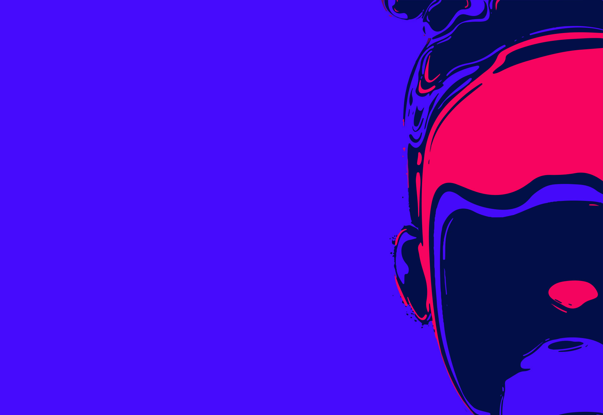

# Braineous Data Platform


### Data Ingestion

Any Artificial Intelligence Application needs real data to learn.
One of the bigger challenges is integrating with Customer Data.
ETL has been in use for years, but the cost of doing those integrations are quite high. Hence, we took a different approach.
We use smart schema mappers in the Cloud to provision your data in a way that fits your AI model.
OpenII Framework is very effective for this. Braineous supports data ingestion in three formats — Json, XML, and CSV. Upon ingestion the data is added to your private
and secure DataLake backed by MongoDB. Later you can use this data to produce datasets to train your AI models.

### Data History

When is comes to AI models, historical data is key. The datasets that train the current models can get slightly off as the models evolve over time and may require re-training. Having data history helps by replaying your modeling efforts from the past, and fitting the models to the new datasets.
But storing such large datasets can become a storage challenge.
The issue is solved by our DiifChain and ObjectDiff algorithms.

### Object Graphs

Having data and trained models provides a starting point for building very intelligent applications. However, once the AI model predicts or provides an insight, it is important to provide solutions via Apps and smart business processes. Data is obviously key to power these Apps.
ObjectGraph technology can be very effective in navigating your Objects using efficient Graph Queries.
The technology that is very effective at this is, Gremlin.


## Areas of Active Research

### Fast Data Processors

AppGal Labs is making a significant investment in pursuit for curing Alzheimer’s disease.
Our research indicates that the cure lies in the Human Genome.
Without understanding the genome, only solutions can be around early detection and medication to slow the progress of the disease,
but eventually the patient loses all memory. I personally believe, this is very unfair to any human that has invested years raising a family and sacrificing for loved ones.
Hence, the motivation for a cure. However, the Human Genome requires studying a data size that is enormous.
Braineous will incorporate ways to process this data in hours, something that usually takes months. The data processors will be generic and can be used on any dataset and not just
the Human Genome.

## Platform
The project uses Quarkus,the Supersonic Subatomic Java Framework.
If you want to learn more about Quarkus, please visit its website: https://quarkus.io/ .

## Running the platform in development mode

```
mvn quarkus:dev
```
## Packaging and running the platform

The platform can be packaged using
````
mvn clean package -Dquarkus.package.main-class=dataplatform -DskipTests
````

It produces the `quarkus-run.jar` file in the `/target/quarkus-app` directory.

The application is now runnable using

````
java -jar -Dquarkus.http.port=80 target/quarkus-app/quarkus-run.jar
````

Check if Data Platform is working
````
 curl http://localhost/data/microservice
 
 Response: {"product":"BRAINEOUS DATA PLATFORM","oid":"4b1fab37-aeef-4846-ac25-f175714043c2","message":"HELLO_AI"}
````

## Swagger Documentation

````
 http://localhost/q/swagger-ui/
````

## Status
